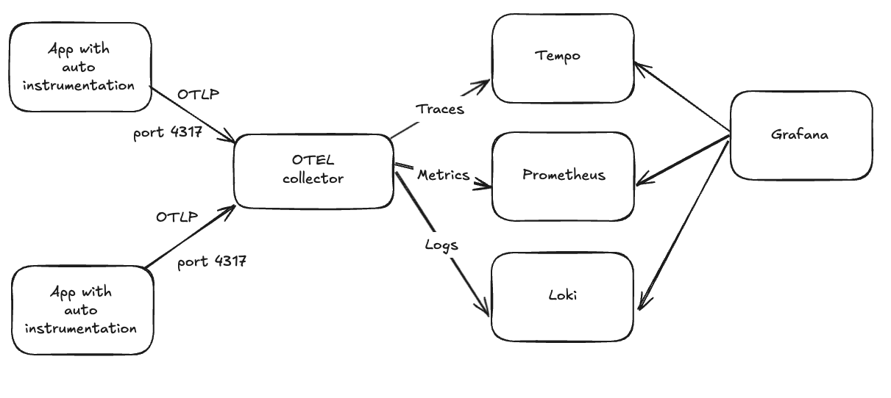

# Demo: OTEL-LGTP integration

This demo showcases how to use OTEL (OpenTelemetry) for both **autoinstrumentation** and **manual instrumentation** in Python applications, and how to visualize telemetry data using Grafana via LGTP (Loki, Grafana, Tempo and Prometheus) stack.



## Components

Component | Description
--- | ---
**Application** | Flask application. There are two types: one with OTEL auto instrumentations enabled and one with OTEL manual instrumentation enabled
**OTEL collector** | A basic OTEL collector that receives telemetry from the application and export them
**Loki** | Used to receive and store logs
**Grafana** | Used for visualization
**Tempo** | Used to receive and store traces
**Prometheus** | Used to receive and store metrics

## Setup and Launch

### Prerequisite

Make sure the following tools are installed locally:
1. Docker
2. Docker Compose
3. Make
4. AWS CLI with credentials configured (We will use a local credentials to list S3 buckets)

### Launch

To launch the application and LGTP stack, simply run:

```
make run-all
```

## How It Works

1. Application is instrumented to use OTEL SDK, API and exporter to send traces, logs and metrics to the OTEL collector via OLTP (OpenTelemtry Protocol) at port 4317.
2. OTEL collector acts as telemetry data pipeline that:
    - Receives data from applications via OLTP
    - Exports the data to multiple backends, eg.
      - Sends traces to Tempo
      - Sends metrics to Prometheus
      - Sends logs to Loki
3. Grafana connects to all three backends:
    - Queries Prometheus for metrics dashboards
    - Queries Tempo for trace visualization
    - Queries Loki for log exploration 

### Clean Up

```
make clean-all
```